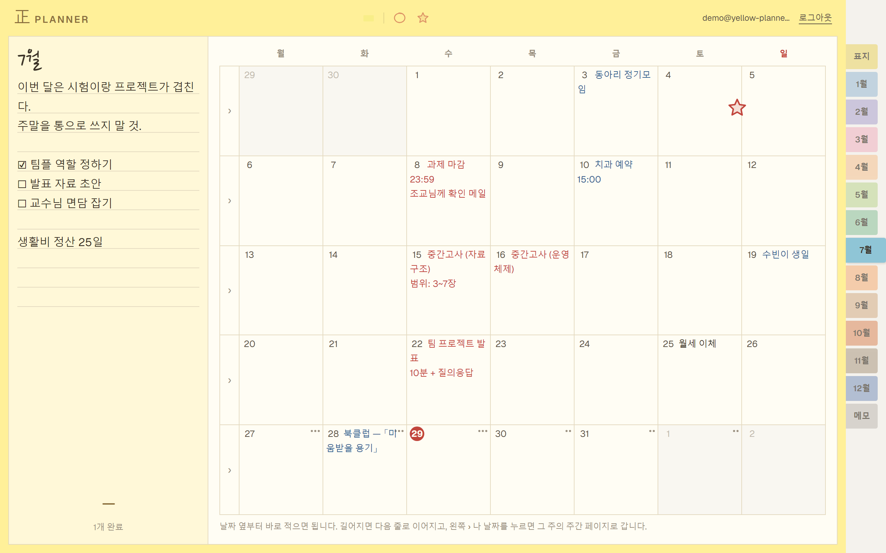
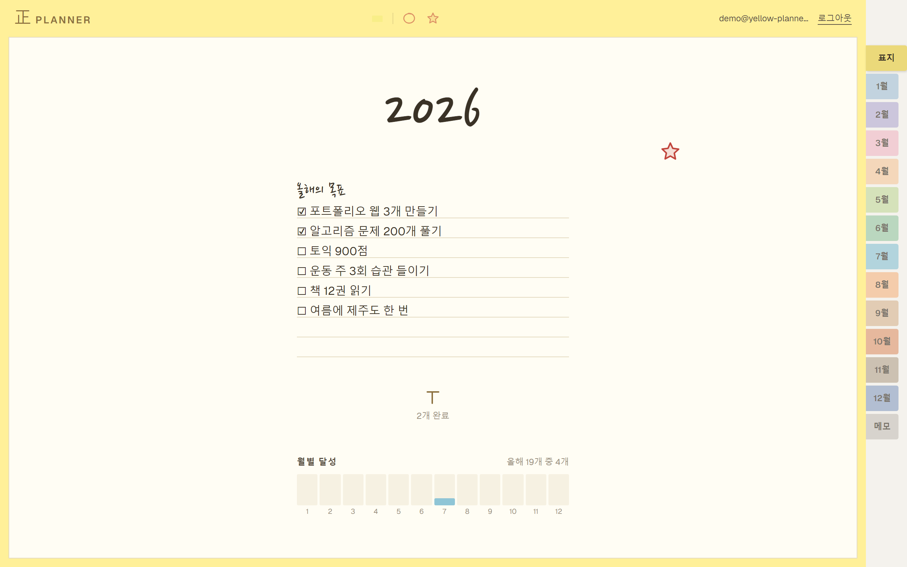
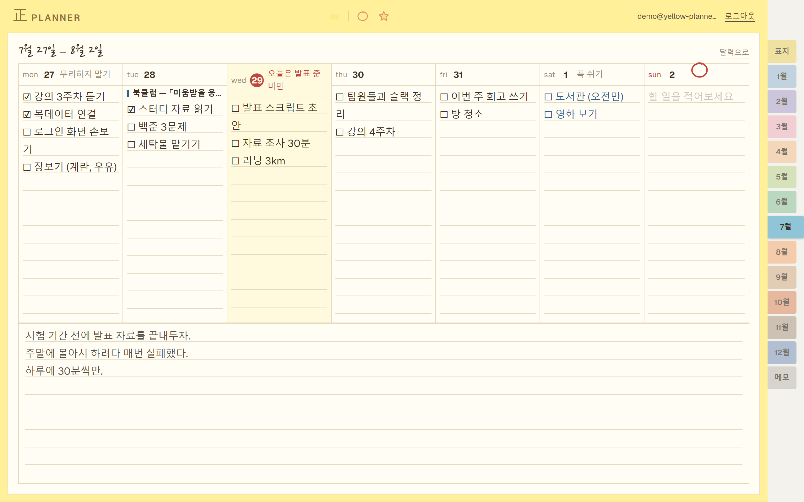
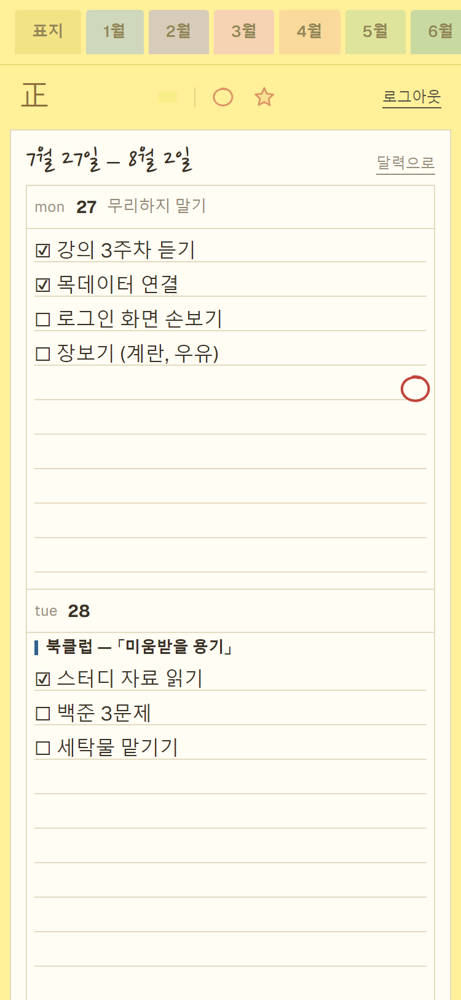
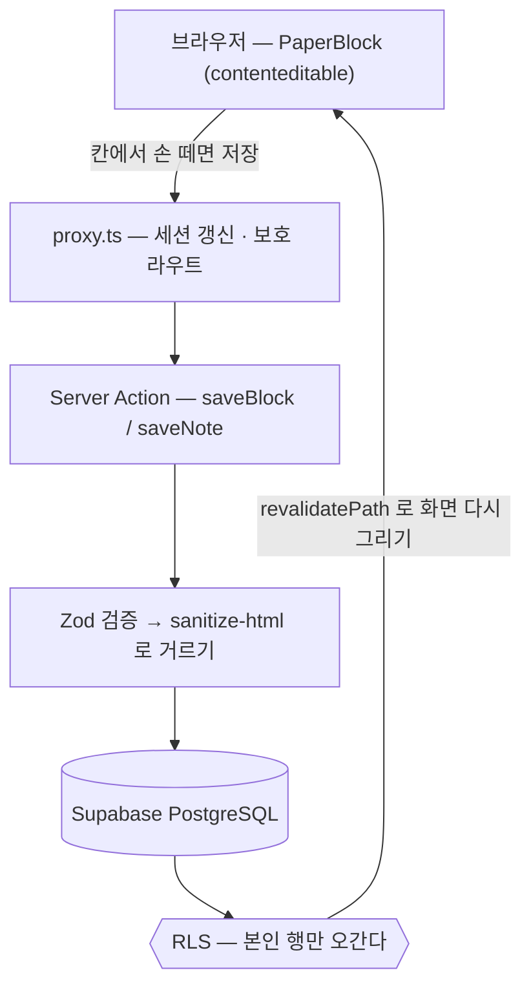

# 正 PLANNER

**중요한 일정과 자잘한 할 일을 서로 다른 페이지에 적는 웹 다이어리**

🔗 **[yellow-planner.vercel.app](https://yellow-planner.vercel.app)** — 첫 화면의
**"데모 계정으로 둘러보기"** 를 누르면 가입 없이 채워진 노트를 볼 수 있습니다.

> 비밀번호를 README에 적지 않고 버튼 하나로 들어가게 했습니다. 공개 저장소에 적힌
> 비밀번호는 그 계정만의 문제로 끝나지 않습니다. 데모 로그인은 서버에서만 일어납니다.



---

## 왜 만들었나

기존 캘린더 앱은 **"중간고사"와 "목데이터 연결하기"를 같은 칸에 같은 크기로** 적습니다.
그러다 보니 정작 중요한 일정이 자잘한 할 일 사이에 묻혀서 눈에 안 들어옵니다.

正 PLANNER는 **적는 곳을 아예 분리**해서 이 문제를 풀었습니다.

| | 어디에 적나 | 무엇을 적나 |
|---|---|---|
| 🔴 **중요한 일정** | 월간 페이지의 달력 칸 | 시험, 마감일, 약속 |
| ⚪ **자잘한 할 일** | 주간 페이지의 요일 칸 | 목데이터 연결, 강의 듣기 |

주간 페이지 상단에는 그 날의 중요한 일정이 **색 띠**로 따라옵니다.
"오늘 뭐 하지"를 볼 때 "이번 주에 뭐가 걸려 있지"를 같이 보게 하려는 의도입니다.

종이 다이어리를 쓰는 감각을 그대로 옮겼습니다. 노란 노트 한 권,
오른쪽에 표지 · 1월~12월 · 메모 인덱스 탭.

---

## 주요 기능

### 표지 — 올해의 목표와 달성률



한 해 목표를 적고, 완료한 개수를 **正 자 획**으로 셉니다. 다섯 개를 채우면 한 글자가
완성됩니다. 아래 막대는 달마다 얼마나 해냈는지 보여줍니다.

### 주간 페이지 — 요일별 할 일 + 이번 주 메모



월요일 시작 7일. 각 칸 맨 위의 색 띠는 그 날 달력에 적어둔 중요한 일정이고,
그 아래가 자잘한 할 일입니다. 아무것도 없는 칸에는 안내 문구가 한 번만 뜹니다 —
일곱 칸 전부에 깔면 화면이 회색 글씨로 뒤덮이기 때문입니다.

### 적는 방법 — 종이에 적듯이

- 칸을 누르면 그 자리에서 바로 적힙니다. 별도 입력창이 열리지 않습니다
- 적던 자리에서 `/` 를 치면 체크박스 · 펜 색 · 굵게 · 형광펜 · 글자 크기를 고릅니다
- 줄 맨 앞에서 `# ` `## ` `### ` 를 치면 그 뒤로 쓰는 글이 커집니다 (26 / 20 / 16px+굵게)
- 이미 적은 글자를 고르면 그 자리에 막대가 떠서 그 부분만 바꿉니다
- 위 도구 막대에서 형광펜을 집어들면 긁는 곳마다 칠해집니다. 스티커도 같은 방식입니다

### 핸드폰에서는 다르게



주간의 7칸을 375px 화면에 가로로 우겨넣으면 한 칸이 45px가 됩니다. 글자 두 자 들어갑니다.
그래서 **세로로 쌓습니다.** 인덱스 탭도 오른쪽 세로에서 위쪽 가로 스크롤로 바뀝니다.

### 그 밖에

- 이메일 회원가입 / 로그인, 계정별 데이터 완전 격리
- 어느 페이지에서든 표지 · 1~12월 · 메모로 바로 이동
- 빈 화면 · 로딩 · 에러 · 없는 주소 화면을 모두 갖췄습니다

---

## 아키텍처



API 라우트가 없습니다. 폼이 Server Action을 직접 부르고, 그 안에서 검증 →
걸러내기 → 저장까지 끝냅니다. **인가는 앱이 아니라 DB가 합니다.**

---

## 기술적으로 신경 쓴 것

### 1. 데이터베이스가 직접 권한을 지킨다 (RLS)

앱 코드에서 `user_id`로 거르지 않습니다. **PostgreSQL의 Row Level Security**가
DB 레벨에서 본인 데이터만 오가도록 강제합니다.

```sql
create policy "본인 항목만" on public.items for all
  using ((select auth.uid()) = user_id)
  with check ((select auth.uid()) = user_id);
```

앱 코드에 버그가 있어도 남의 데이터는 새어나가지 않습니다.
다른 사람의 id로 삭제를 시도하면 에러가 아니라 **0건 처리**로 끝납니다.

`(select auth.uid())`로 감싼 것은 행마다가 아니라 쿼리당 한 번만 평가시키기 위한 것입니다.

> **교차 검증함.** 계정 A로 표지·달력·주간·메모를 채운 뒤 계정 B로 들어가
> 네 화면이 모두 비어 있는 것을, 다시 A로 돌아와 그대로 남아 있는 것을 확인했습니다.
> 화면에서 숨긴 것이 아니라 **서버 응답에 애초에 들어 있지 않습니다.**

### 2. 테이블 하나로 네 개의 화면을 굴린다

표지 · 월간 왼쪽 칸 · 달력 칸 · 주간 요일 칸은 **"날짜에 묶인 짧은 글 + 체크"** 라는
같은 구조입니다. 테이블을 나누는 대신 `kind` 컬럼 하나로 구분했습니다.

| `kind` | 화면 | `date`에 저장하는 값 |
|---|---|---|
| `year` | 표지 | 그 해 1월 1일 |
| `month` | 월간 왼쪽 칸 | 그 달 1일 |
| `event` | 달력 칸 (중요 일정) | 실제 날짜 |
| `task` | 주간 요일 칸 (자잘한 할 일) | 실제 날짜 |
| `daily` | 주간 요일 머리의 한 줄 | 실제 날짜 |
| `sticker` | 페이지에 붙인 스티커 | 그 페이지의 기준일 |

덕분에 CRUD 구현 한 벌(`PaperBlock` 컴포넌트 + Server Action 하나)이
네 화면 전부를 담당합니다.

### 3. 적고 있는 칸을 다시 그리지 않는다

React 19는 prop이 바뀌었는지 값이 아니라 **참조**로 판단합니다.
`dangerouslySetInnerHTML={{ __html: 문자열 }}` 은 매 렌더마다 새 객체를 만들기 때문에,
내용이 같아도 매번 `innerHTML`을 다시 써넣습니다. 그래서 적고 있던 글이 통째로
초기값으로 되돌아가고 커서가 사라졌습니다.

객체 자체를 `useRef`로 붙들어 참조를 불변으로 만들었습니다. 실제 크롬을 계측해서
잡은 문제입니다 — 편집기 노드는 그대로인데 자식 11개가 통째로 교체되고 있었습니다.

대가로 이 칸은 한 번 열리면 서버 내용을 다시 받아오지 않습니다. 혼자 쓰는 다이어리라
감수했고, 여럿이 쓰게 되면 `updated_at` 비교가 필요하다고 코드에 적어뒀습니다.

### 4. Next.js 16 기준으로 작성

- `middleware.ts`는 16에서 **deprecated**. `proxy.ts` 규약을 사용했습니다
- `cookies()`, `params`, `searchParams`가 모두 async — 전부 `await` 처리
- 에러 화면은 `reset`이 아니라 **`unstable_retry`** (16.2에서 들어온 이름).
  `reset`은 다시 그리기만 하고 `unstable_retry`는 서버에서 데이터를 다시 받아옵니다
- API 라우트 없이 **Server Actions**로 처리

### 5. 인증에서 흘리지 않기

- 세션 검증은 `getSession()`이 아니라 **`getUser()`** — `getSession()`은 쿠키를 그대로 믿기 때문에 위조가 가능합니다
- 로그인 실패 메시지를 일부러 뭉뚱그렸습니다. "비밀번호가 틀렸습니다"는 **그 이메일이 가입돼 있다는 사실**을 알려주는 셈이라 계정 목록을 캐낼 수 있습니다
- `?next=` 파라미터는 내부 경로만 허용 — 외부 주소로 튕기는 오픈 리다이렉트 방지
- 붙여넣기는 글자만 받고, 저장 직전에 `sanitize-html`로 한 번 더 거릅니다

---

## 기술 스택

| 분류 | 사용 기술 | 왜 |
|---|---|---|
| 프레임워크 | Next.js 16.2 (App Router, Turbopack) | Server Actions로 API 라우트를 안 만들어도 되고 Vercel 배포가 무설정 |
| UI | React 19.2, TypeScript 5, Tailwind CSS 4 | 디자인을 직접 하므로 유틸리티 방식이 가장 빠름. 색은 `@theme` 토큰 한 곳에서 관리 |
| 백엔드 | Supabase (PostgreSQL + Auth), `@supabase/ssr` | 무료 티어로 Postgres·인증·RLS를 한 번에. 인가를 DB 계층에 두려면 RLS가 필요했음 |
| 검증 | Zod 4 | Server Action에 들어오는 값은 전부 남이 보낸 것이라 서버에서 다시 검사 |
| 걸러내기 | sanitize-html | 서식을 담으려고 HTML로 저장하므로 저장 직전에 허용 목록으로 거름 |
| 날짜 | date-fns 4 | 주/월 경계 계산. `toISOString()`은 UTC로 바꿔 하루 밀리므로 쓰지 않음 |
| 배포 | Vercel | `main` push 시 자동 배포 |

**의도적으로 안 쓴 것:** 전역 상태 라이브러리(React 내장으로 충분), Prisma(Supabase
클라이언트로 충분), 리치 텍스트 에디터 라이브러리(종이 느낌을 내려면 직접 만드는 편이 빨랐음).

---

## 로컬에서 실행하기

```bash
git clone https://github.com/sarasoobin/yellow-planner.git
cd yellow-planner
npm install
```

`.env.local` 파일을 만들고 아래 값을 채웁니다.
값은 [Supabase 대시보드](https://supabase.com/dashboard) → Settings → API keys에서 확인할 수 있습니다.

```env
NEXT_PUBLIC_SUPABASE_URL=https://<프로젝트-id>.supabase.co
NEXT_PUBLIC_SUPABASE_ANON_KEY=sb_publishable_...
NEXT_PUBLIC_SITE_URL=http://localhost:3000

# 데모 계정 (선택) — 없으면 "둘러보기" 버튼만 안내 문구를 띄웁니다
DEMO_EMAIL=demo@yellow-planner.app
DEMO_PASSWORD=...
```

> `service_role` / Secret key는 **RLS를 무시**합니다. 절대 코드나 `.env`에 넣지 마세요.
> `DEMO_PASSWORD` 에 `NEXT_PUBLIC_` 을 붙이면 브라우저 번들에 그대로 박혀 나갑니다.

Supabase SQL Editor에서 [`supabase/latest.sql`](supabase/latest.sql)을 실행해 테이블과
정책을 만든 뒤:

```bash
npm run dev     # 개발 서버
npm run build   # 배포 빌드
npm run lint    # 검사
npm run icons   # src/app/icon.svg 에서 파비콘·홈 화면 아이콘 다시 만들기
```

[http://localhost:3000](http://localhost:3000)에서 확인할 수 있습니다.

---

## 프로젝트 구조

```
src/
├── proxy.ts                    모든 요청을 통과시키는 인증 문지기 (Next 16 규약)
├── lib/
│   ├── types.ts                Item · ItemStyle · 글자 크기
│   ├── dates.ts                주/월 경계 계산 (주는 월요일 시작)
│   ├── blocks.ts               행 → 한 칸으로 묶기, 체크 개수 세기
│   ├── rich-text.ts            저장한 HTML ↔ 화면에 그릴 HTML
│   ├── sanitize.ts             저장 직전 허용 목록 거르기 (서버 전용)
│   ├── supabase/               브라우저 / 서버 / 세션 갱신 클라이언트
│   └── actions/                Server Actions (auth, items, notes)
├── components/
│   ├── paper-block.tsx         한 칸 편집기 — `/` 메뉴, 마크다운, 형광펜, 체크박스
│   ├── note-editor.tsx         괘선 메모 (주간 아래칸 · Free Note)
│   ├── calendar-cell.tsx       달력 한 칸
│   ├── index-tabs.tsx          표지·1~12월·메모 탭 (데스크톱 세로 / 폰 가로)
│   ├── tally-mark.tsx          正 자 집계
│   ├── toolbar.tsx             형광펜 · 스티커 통
│   └── sticker-layer.tsx       페이지 위에 스티커 붙이고 끌기
└── app/
    ├── layout.tsx              폰트 · 메타데이터 · themeColor
    ├── manifest.ts             홈 화면에 추가했을 때 쓰는 정보
    ├── icon.svg                아이콘 원본 (나머지는 `npm run icons`)
    ├── error.tsx               랜딩·로그인 오류
    ├── global-error.tsx        루트 레이아웃이 터졌을 때 (자체 html/body)
    ├── not-found.tsx           없는 주소 · notFound()
    ├── login/                  로그인 · 회원가입
    └── (planner)/              노트 껍데기 (헤더 · 인덱스 탭)
        ├── loading.tsx         페이지 넘기는 동안의 종이 뼈대
        ├── error.tsx           노트 안에서 난 오류
        ├── cover/              표지
        ├── month/[ym]/         월간 페이지
        ├── week/[start]/       주간 페이지
        └── note/               Free Note

scripts/make-icons.mjs          icon.svg → favicon.ico · apple-icon · 안드로이드 아이콘
supabase/latest.sql             테이블 · 트리거 · RLS 정책 (여러 번 실행해도 안전)
docs/                           스크린샷과 손그림 시안
```

---

## 기획 문서

| 문서 | 내용 |
|---|---|
| [PRODUCT.md](PRODUCT.md) | 무엇을 왜 만드는가, 데이터 모델, 라우트 |
| [DESIGN.md](DESIGN.md) | 컬러 · 타이포 · 레이아웃 · 반응형 규칙 |
| [PLAN.md](PLAN.md) | 3일 개발 계획과 완료 기준 |
| [CHANGELOG.md](CHANGELOG.md) | 버전별 변경 이력 |
| [docs/회고-v1.0.0.md](docs/회고-v1.0.0.md) | 왜 그렇게 만들었나, 오래 걸린 문제와 해결 |

---

## 다음 단계

시간상 하지 않았지만 무엇이 필요한지는 알고 있는 것들입니다.

- **테스트 코드** — 지금은 Playwright로 실제 크롬을 띄워 손으로 확인하고 있습니다.
  `lib/dates.ts` 의 주/월 경계 계산부터 단위 테스트로 묶는 것이 우선입니다
- **동시 편집 충돌 처리** — 두 기기에서 같은 칸을 열어두면 나중에 저장한 쪽이 앞의 것을
  조용히 덮어씁니다. 저장할 때 `updated_at`을 비교해 알려주는 장치가 필요합니다
- **오프라인 지원** — 지금은 인터넷이 끊기면 저장이 실패합니다. 다이어리는 지하철에서
  펴는 물건이라 이게 제일 아쉽습니다
- **되돌리기(Undo)** — 형광펜을 잘못 칠하면 같은 자리를 다시 긁어 지우는 것이 유일한 방법입니다

## 알려진 사항

`npm audit`에 고위험 항목이 보고되지만 **의도적으로 두었습니다.**
전부 `eslint` / `postcss` / `sharp` 등 **빌드·개발 단계에서만 쓰이는 의존성**이며
런타임에 포함되지 않습니다. `npm audit fix --force`는 Next.js를 9.3.3으로
다운그레이드하기 때문에 실행하지 않았습니다.
